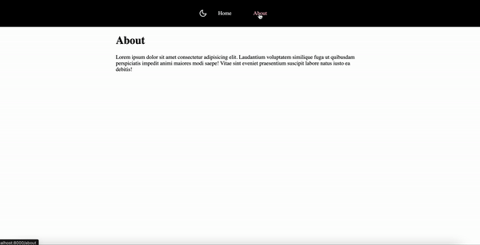

<p align="center">
  <a href="https://www.gatsbyjs.com">
    
  </a>
</p>
<div align="center">
  <h1>Gatsby dark mode example</h1>

  <p>Simple dark mode functionality for Gatsby app. </p>
  If you want to read step by step tutorial for creating a dark mode, check <a href="https://www.webdevolution.com/blog/Create-Gatsby-Dark-Mode">this </a> blog post.
</div>

## 🚀  Quick start

1. Install dependencies.

```shell
  npm install
```

2. Launch app

```shell
  npm start
  ```
  
